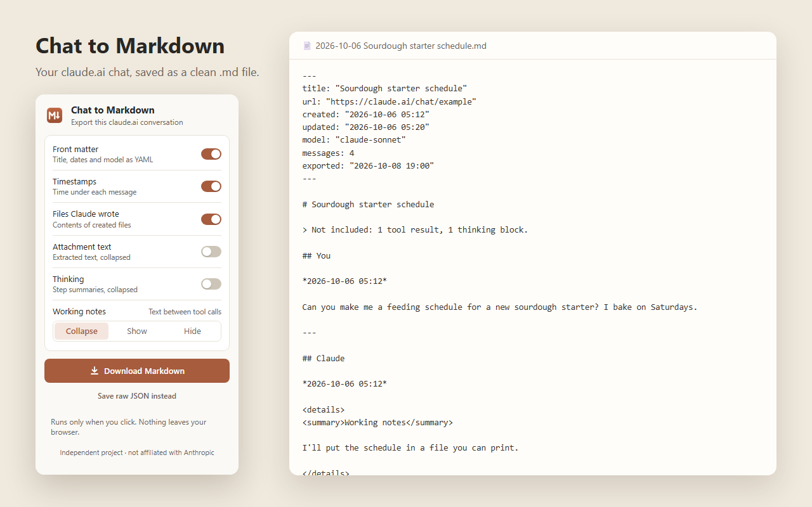

<h1 align="center">Chat to Markdown for Claude</h1>

Save any claude.ai conversation as a clean Markdown file, in one click. 
Runs only when you click it. Nothing leaves your browser.

<b>Chrome Web Store: coming soon</b> (in review)

## Features

- **Clean structure.** “You” / “Claude” headings, with optional timestamps and YAML front matter (title, dates, model).
- **Files Claude created** are included as code blocks with the right language.
- **Working notes.** The text Claude writes between tool calls can be collapsed, shown, or hidden.
- **Thinking summaries and attachment text**, optional, in collapsible blocks.
- **Pasted terminal output keeps its formatting** in your own messages.
- **Edited chats** export only the branch you're looking at.
- **Attachments** are listed by name and size. A “Not included” line counts anything left out.
- **Save raw JSON** if you want the complete data.

Your option choices are remembered between exports.

## How to use

1. Open a conversation on [claude.ai](https://claude.ai).
2. Click the extension icon. Pin it from Chrome's puzzle-piece menu so it's always visible.
3. Choose your options and click **Download Markdown**.

The file is named `YYYY-MM-DD Chat title.md` and goes to your normal Downloads folder.

## Privacy

- No background process and no access to any site until you click the icon.
- The chat is read using your existing claude.ai session and converted **inside your browser**.
- Nothing is sent to the developer or anyone else. No analytics or tracking.
- Permissions: `activeTab` (the current tab, only after you click) and `scripting` (to run the export in that tab).

Full policy: [PRIVACY.md](PRIVACY.md).

## Limitations

- Works on claude.ai conversations in Chrome (and other Chromium browsers).
- It reads the same data the claude.ai website uses, which isn't an official API. If claude.ai changes, exports may break until the extension is updated.
- Images and other binary files are listed, not embedded.
- Thinking is exported as the step summaries claude.ai shows, not full text.

## Problems or ideas

[Open an issue](../../issues/new/choose). **Don't paste private conversations.** Describe the problem, or use a test chat with nothing sensitive in it.

## Install from source

1. Download this repository (**Code → Download ZIP**) and unzip it.
2. Open `chrome://extensions` and turn on **Developer mode**.
3. Click **Load unpacked** and select the unzipped folder.

## Development

No build step. The extension is `manifest.json`, `popup.html`, `popup.js`, `convert.js` and `icons/`.

- `convert.js` holds all the conversion logic. It has no DOM dependency, so it runs in Node:
  `node -e "const {toMarkdown}=require('./convert.js'); console.log(toMarkdown(require('./tools/sample-fixture.json'),'url',{}))"`
- `tools/make_icons.py` redraws the icons and promo tile (needs Pillow).
- `tools/make_screenshot.js` builds the store screenshot from the synthetic `tools/sample-fixture.json`.
- `tools/pack.ps1` builds the Chrome Web Store zip into `dist/`.

---

Independent project. Not affiliated with, endorsed by, or sponsored by Anthropic. Claude is a trademark of Anthropic, PBC.
